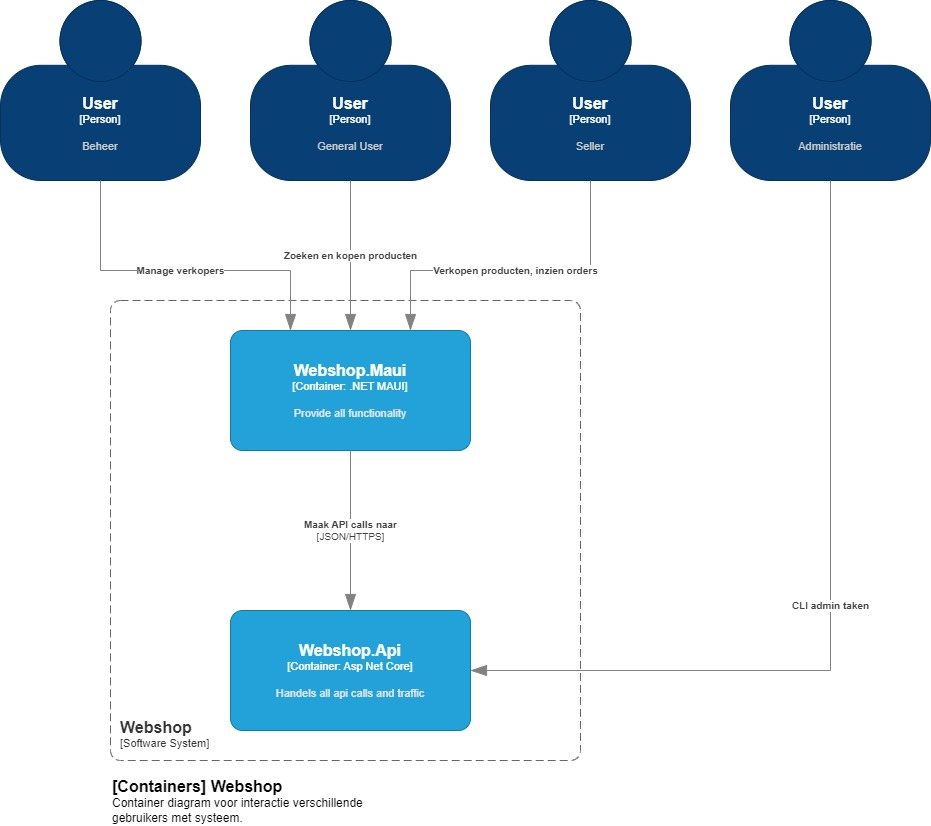

# Webshop
[poging 2 branch](https://github.com/kitfka/School-kwaliteit2/tree/gitserver)

## Omschrijving
Dit is gemaakt door de Windesheim afstudeerder Philip Thuijs 
Dit is een webshop applicatie gemaakt met .NET MAUI.
Reverenties naar de VM zijn er uit gehaald en moet in ApiService.cs aangepast worden voor verder gebruik van de code.

## Installation
Er zijn geen installers, volg de instructie hier onder.

## Applicatie draaien
Om de applicatie te draaien is het volgende nodig:
- .NET 8 instalatie;
- De correcte workloads;
- .NET MAUI.

Voor de .NET MAUI workloads gebruik het volgende command:
```cmd
dotnet workload install maui
```

De rest kan met de Visual Studio Installer geregeld worden.

## C4 model




## Authors and acknowledgment
Philip Thuijs
